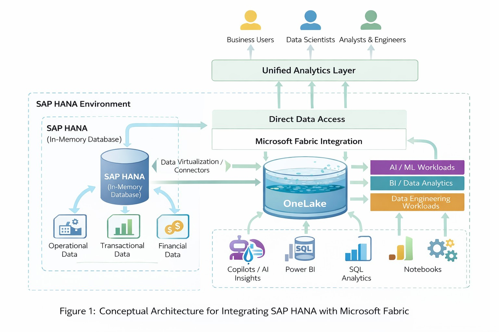

# Architecture Context

## Beyond the silo

Enterprise data platforms have reached a point where performance alone is not enough. SAP HANA's in-memory, column-oriented design enabled fast operational and analytical workloads. At the same time, organisations still face friction when critical application data must be repeatedly extracted, copied and reshaped for broader analytics.

Microsoft Fabric and the lakehouse direction introduce a different organising idea: a shared analytical environment in which engineering, warehousing, reporting and data-science workloads can operate with more continuity. In a real enterprise, the design choice is not simply “move HANA into Fabric.” Teams must decide which data remains governed by the SAP system of record, which data is replicated, how freshness is measured, and where semantic definitions and access controls are owned.

## Preserved conceptual model

The original repository contrasted an ETL-heavy traditional model with an emerging HANA-and-Fabric model in which Fabric provides a unified analytics layer and OneLake supports shared analytical access. The image and discussion are conceptual. This lab implements neither live connectivity nor a production integration pattern.

## Sustainable-manufacturing scenario

The original scenario considered a Melbourne organisation working with sustainable packaging materials such as bagasse. Operational order data could remain governed in SAP while an analytical platform supports reporting on demand, waste and material use. Faster access may improve responsiveness, but the result still depends on reliable mapping, security, governance and business interpretation.

The runnable lab narrows that scenario to a transparent validation task. Two synthetic CSV files stand in for controlled source and target extracts. This makes it possible to demonstrate reconciliation mechanics without fabricating access to SAP HANA or Microsoft Fabric.

## Architectural considerations

### Data movement and access

Reducing unnecessary copies can lower operational friction, but “less movement” is not an unconditional goal. Retention, latency, workload isolation, sovereignty, licensing, network design and recovery requirements determine whether replication, virtualisation or a hybrid approach is appropriate.

### Decision context

Fresher integrated data can improve decision timing. That value exists only when business keys, measures, statuses and transformation rules remain consistent from source to consumption.

### Governance and people

An integrated platform changes responsibilities as well as technology. Data owners, engineers, analysts and business users need visible definitions, access boundaries, quality controls, exception routes and training. Architecture alone does not guarantee adoption or trustworthy decisions.

### Migration assurance

Migration validation should combine technical controls with business acceptance. Row counts, duplicates, required fields, missing records, field comparisons, aggregates and status distributions provide complementary evidence. UAT and documented handover turn those checks into an accountable operating process.

## References from the original discussion

- Armbrust, M., Ghodsi, A., Zaharia, M., et al. (2020). *Delta Lake: High-Performance ACID Table Storage over Cloud Object Stores*.
- Färber, F., Chaudhuri, S., et al. (2012). *SAP HANA Database: Data Management for Modern Business Applications*.
- Microsoft (2023). *Microsoft Fabric: Architecture and OneLake Overview*.

These references provide conceptual background only; the repository does not use their services or code.
